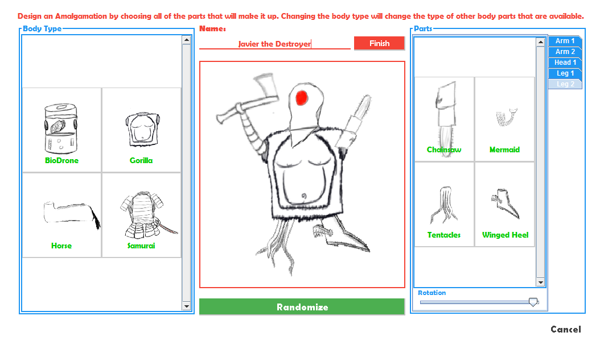
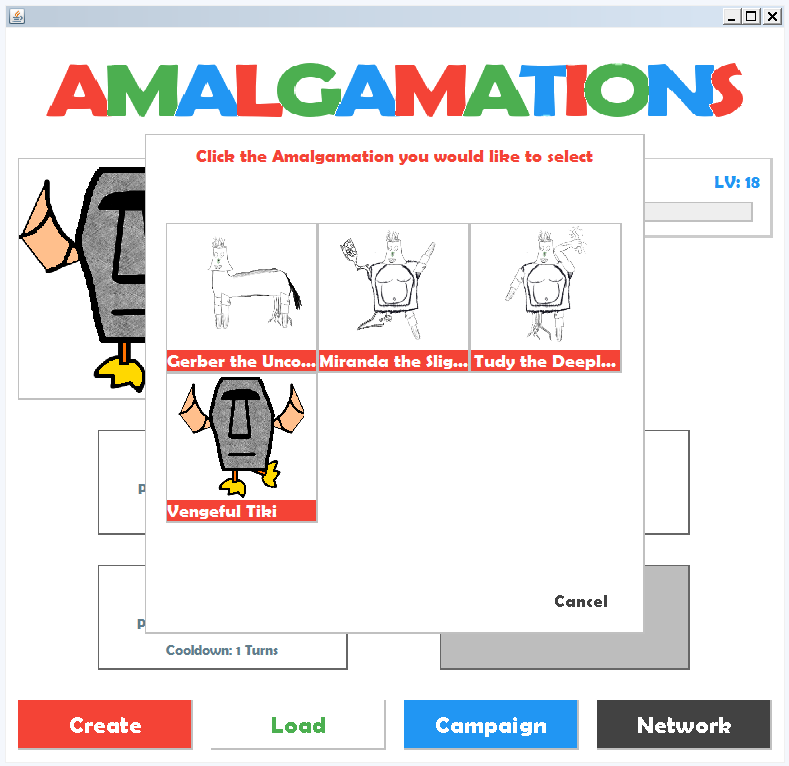
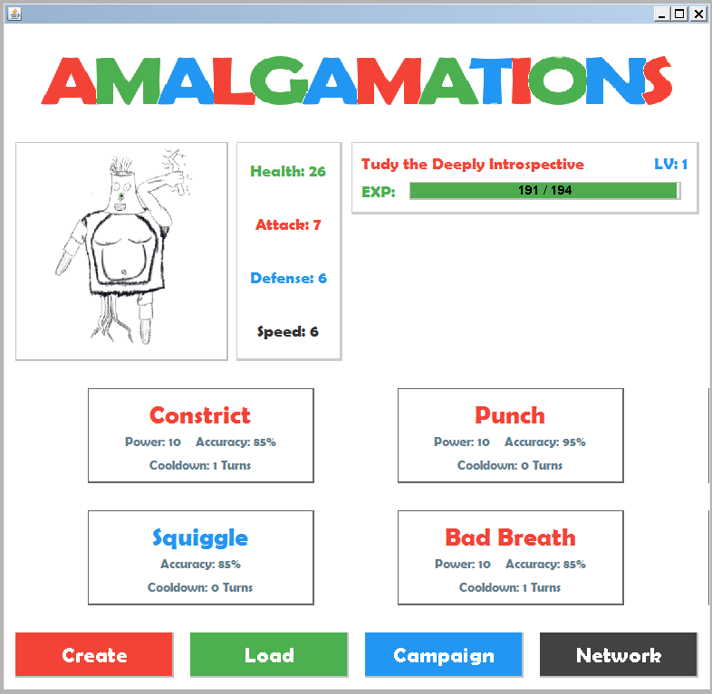

######Created by Caleb Rush, Jordan LaRiccia, and Adam Meanor

#Description

Amalgamations is a turn based strategy game where players can create their own characters called "Amalgamations" and do battle.

Main features of the game:
- Use a Character Creator to create an Amalgamation out of a variety of different parts
- Use the Amalgamations you have created to participate in a single player Campaign Mode and battle against randomly generated, AI Amalgamations and battle against uniquely made boss Amalgamations (which are unlocked when defeated).
- Use the Amalgamations you have created to battle against other players and their Amalgamations over a shared network connection.

Amalgamations was designed as a course project for an introductory Software Engineering course. It is written entirely in Java and uses no external libraries other than Java's included API's. All images used were drawn by Jordan LaRiccia (all regular Amalgamation parts) and Caleb Rush (boss Amalgamation parts and logo). The [main menu song](Amalgamations/res/audio/menu.wav) was created by Jordan LaRiccia. Everything else is royalty free and not made by us.

#Terminology

###Amalgamation

[Oxford Dictionary definition for Amalgamation:](http://www.oxforddictionaries.com/us/definition/american_english/amalgamation)
>The action, process, or result of combining or uniting

Amalgamations are the playable characters in the game. Visually, an Amalgamation is a collection of **Parts** which determine the Amalgamation's **Abilities** and **Stats**.

###Part

Parts are the pieces that Amalgamations are made up of. Visually, they are different body parts: Arms, Legs, Heads, and Bodies. An Amalgamation's most distinct characteristics come from what Parts it is made up of. Each Part contributes towards the Amalgamation's overall **Stats** and contains a list of **Abilities** that the Amalgamation may learn due to having the Part.

###Ability

Abilities are the actions that can be performed by Amalgamations in battle. They may be Attacks that will hurt other Amalgamation, or it may just be a regular Ability that powers up the Amalgamation. The Abilities that an Amalgamation can learn are determined by the Parts that make up the Amalgamation. Of the total collection of Abilities that an Amalgamation can learn, only 4 can be known by an Amalgamation at any given time.

###Stats

Stats are measurements of an Amalgamations capability. More specifically, stats are used in calculations in battle to determine different things. The **Health** stat determines how much damage an Amalgamation can take in battle before being defeated. The **Attack** stat (combined with an Attack's power) determines how much damage an Amalgamation can inflict. The **Defense** stat determines how much damage an Amalgamation can withstand without losing any Health. The **Speed** stat is used to determine which Amalgamation gets to perform their Ability first each turn in battle.

While each Part generally supplies a little of each stat to an Amalgamation, each category of Part has a "specialty" stat that it typically supplies more to.
- **Heads** mostly supply **Health**
- **Arms** mostly supply **Attack**
- **Bodies** mostly supply **Defense**
- **Legs** mostly supply **Speed**

#Structure

Following are some simplified class diagrams demonstrating how some key classes in Amalgamations are structured. Several details are ommitted for sake of readability. If you wish to see all of the classes in Amalgamations in full detail, go to the [class diagram folder in doc subdirectory](Amalgamations/doc/Class Diagrams/).

###Parts

Amalgamations were described as being made up of many Parts. The more technically true description is that each Amalgamation contains a Body, and each Body contains a variety of Parts. Note that a Body is also a type of Part, meaning that the entire Part structure follows the General Hierarchy design pattern. There is a slight modification, however, in regards to the Slot class. While each Body can have multiple parts, it is desirable to specify what kind of Parts the Body can hold. Take a regular human body as an example; it contains two Arms, two Legs, and a Head. A Spider body, however, will have 6 Legs, a Head, and no Arms. If the Body class was simply associated directly with Part, it would make it complicated for specific types of Bodies to make distinctions on what types of Parts it can contain. The Slot class is used as an intermediate class that a Body can use to specify that a specific Part must be of a specific type (Arm, Head, or Leg). On top of providing this helpful feature, a Slot is also used to add further details to each of the Body's parts in regards to their position when drawing.

###Abilities

Every Part has a list of Abilities that it allows the Amalgamation containing it to learn, but the Amalgamation cannot use an Ability unless it has its own reference to the Ability. This allows each Amalgamation instance to maintain a list of all of its learnable Abilities while only being able to use a select subset of them. An Amalgamation can only learn up to 4 of their Abilities at any given time.

As for the structure of an actual Ability, each Ability has a list of StatModifiers that can modify the Stats of either the user of the Ability, or the target of the Ability. Along with the actual effect, each StatModifier contains a line of text that can be read in Battle to describe what actually happened when the StatModifier was executed. A typical line of text for an Ability that raises the user's speed might read: "[User's name]'s SPEED was doubled!". By default, the Ability's affect method goes through its list of StatModifiers and executes them, while building a full script from each modifier's line of text. This heavy structuring is intended to make it easy to create many different Abilities using a graphical tool rather than coding each one, which is exactly how every Ability in the game was made (all of the Parts and Campaign Levels were made with graphical tools as well. The sources for these tools are included in the [tool package](Amalgamations/src/tool/)). The Attack class is a simple extension of the Ability class. It has all of the same capabilities with the addition of automatically calculating and dealing damage to the target based on the Attack's power and the user's Attack stat.

###Battles

A Battle is always fought between two opposing Amalgamations. While the Amalgamations themselves contain the Abilities and Stats that are used in Battle, it is necessary for a 3rd (and 4th) party to dictate how the Amalgamation performs in Battle, reading each turn's script and telling it what action or Ability to perform each turn. In the current scope of the game, there are three different methods of controlling an Amalgamation in battle:
1. Have the user currently playing decide what to do
2. Have Artifical Intelligence decide what to do
3. Have some unknown entity on the other side of a network connection decide what to do.
These different methods are handled by the BattleDialog, AIController, and NetworkController classes respectively.

######BattleDialog

The BattleDialog is the GUI a player will most likely see the most of. The BattleDialog is exactly what you would picture when you think of a Battle. It displays the player and the opponent Amalgamations, their levels, their health bars, and shows the user their Amalgamation's Abilities and lets them click on one (or a few other optional actions such as Do Nothing and Forfeit) to dictate what the Amalgamation will do in their next turn. Each turn, the script is displayed line by line to the user while enacting only a few animations (such as when health is lost or gained). It is up to the user to interpret the scripts and determine their strategy based on the events depicted. Generally, only one of the Amalgamations in a battle should be controlled by a BattleDialog, otherwise you would essentially have one user controlling both Amalgamations, which would make for an unexciting match.

######AIController

The AIController represents the Artificial Intelligence in the game. The AIController is used for the opposing Amalgamation in every battle in Campaign Mode. While, in theory, an AIController may use predefined logic to scan through the script, analyze its and its opponent's Amalgamations, and choose its best action, it currently just selects a valid move at random. The only real battle logic that the AIController currently follows is that it will always use an Ability as long as it has a usable one available. Only when it doesn't will it Do Nothing. The AI will never Forfeit.

######NetworkController

The NetworkController is used to allow another player to control the opposing Amalgamation in a Battle from across a shared network connection. The premise of the actual NetworkController class is actually fairly simple; it must establish a network connection (TCP) when being instantiated. Then, every time it is updated on the status of the Battle, it sends all of the information it receives across the connection. Whenever the Battle requires the NetworkController to select a move, the NetworkController awaits a response from the connection to indicate what move to perform.

The NetworkAdapter class is designed to connect to the other side of a connection with a NetworkController. A NetworkAdapter is designed to receive information any time it expects the NetworkController will send it, and sends information whenever it believes the NetworkController is expecting it. The NetworkAdapter delegates all logic and script reading to another Controller instance. In a typical network Battle, this Controller instance will be another BattleDialog for the opponent (from the original player's perspective) to control their Amalgamation. Whenever the NetworkAdapter receives an update on the Battle, it will send the information to the BattleDialog which will update as it would in any other Battle and await for the opposing player to select a move, which it will send to the NetworkAdapter, which will send it over the network to the NetworkController, which will send it to the Battle. Note that in this entire setup, there is only one Battle instance controlling the logic on the original player's machine (known as the host).

#Screenshots

